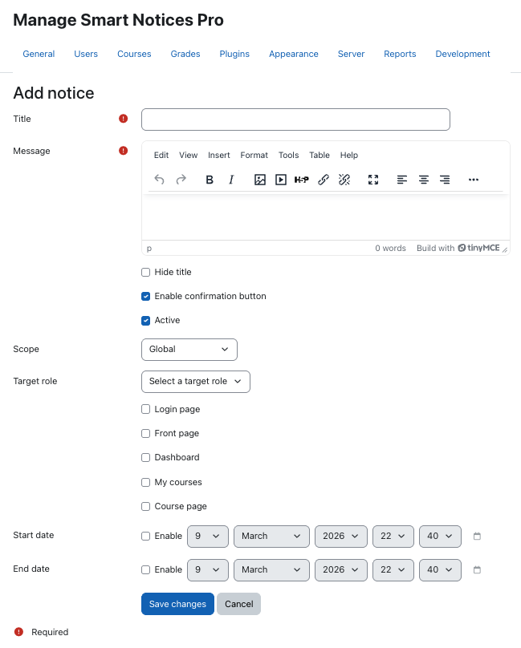
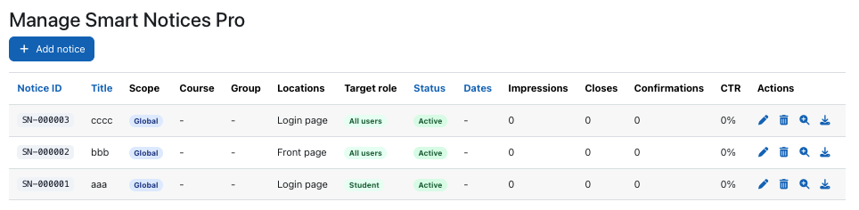
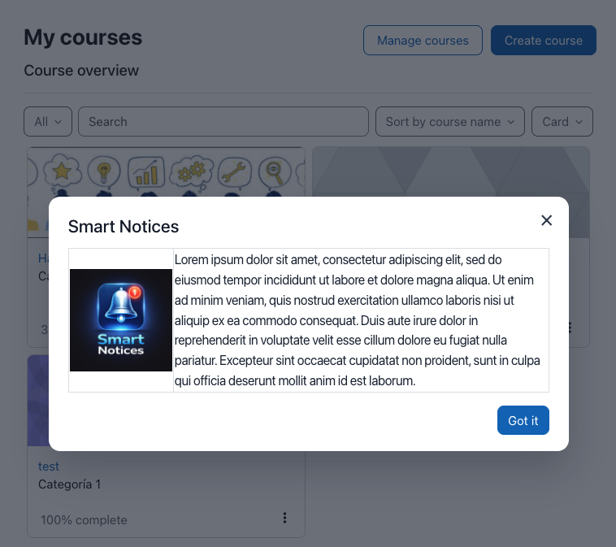
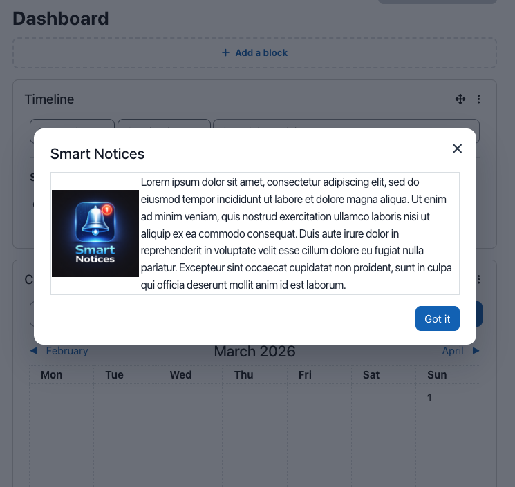
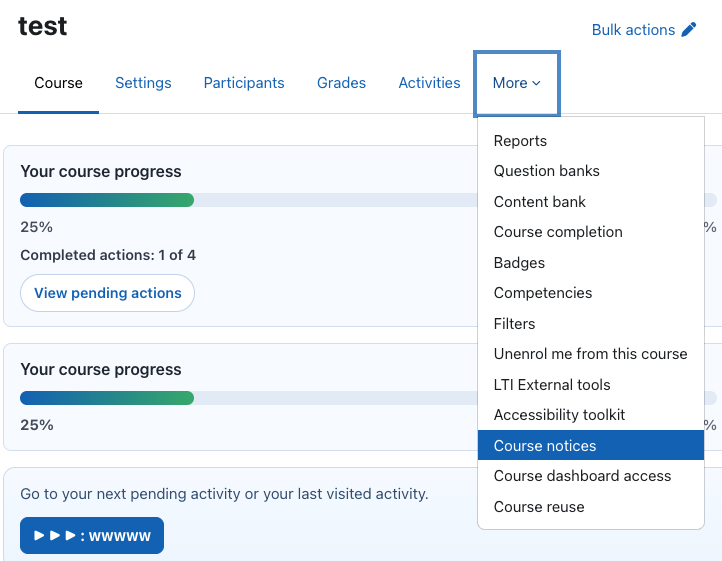
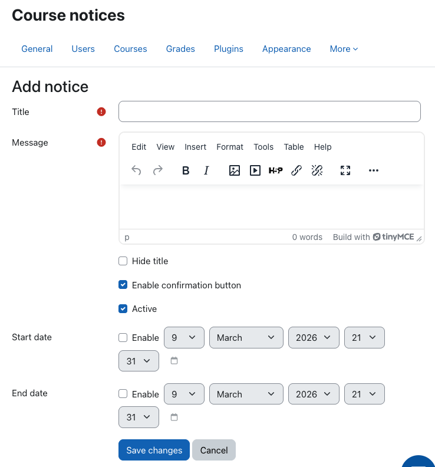
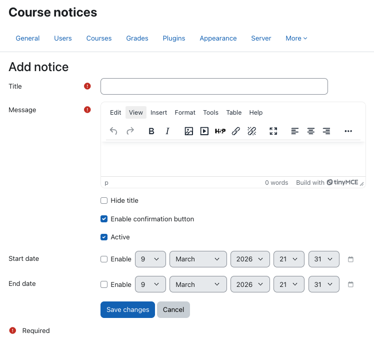
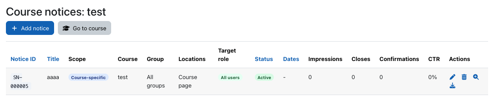

# Manual completo de uso

Este documento cubre todas las funciones disponibles en **Smart Notices Pro** (`local_smartnoticespro`).

## 1. Qué hace Smart Notices Pro

Smart Notices Pro permite publicar avisos modales segmentados por:

- Ubicación
- Rol objetivo
- Curso y grupo (en avisos de curso)
- Rango de fechas
- Estado activo/inactivo

También incluye métricas por aviso, reportes de interacciones y exportación CSV.

## 2. Requisitos

- Moodle 4.5+
- PHP 8.1+

## 3. Roles y capacidades

Capacidades del plugin:

- `local/smartnoticespro:manageglobalnotices`
- `local/smartnoticespro:managecoursenotices`
- `local/smartnoticespro:viewnotices`

### Gestor / Administrador

Con `manageglobalnotices` puede:

- Crear/editar/eliminar avisos globales.
- Crear/editar/eliminar avisos de curso desde el listado general.
- Definir rol objetivo, ubicaciones y fechas.
- Ver métricas y reportes.
- Exportar CSV.

Ruta principal:

- `Administración del sitio > Plugins > Plugins locales > Manage Smart Notices Pro`

### Profesor

Con `managecoursenotices` puede:

- Gestionar avisos solo de su curso.
- Crear/editar en una página dedicada del curso.
- Definir `Grupo objetivo`:
  - `Todos los grupos`
  - Grupo específico
- Ver métricas/reportes de los avisos del curso.

Ruta principal:

- Dentro del curso: `Avisos del curso`

## 4. Ubicaciones disponibles

- Página de acceso (`/login/index.php`)
- Página principal (`/index.php`)
- Área personal (`/my`)
- Mis cursos (`/my/courses.php`)
- Dentro de un curso (`/course/view.php`)

## 5. Crear un aviso (paso a paso)

1. Abre el listado de avisos.
2. Clic en `Agregar aviso`.
3. Completa:
   - `Título`
   - `Mensaje`
   - `Ocultar título` (opcional)
   - `Habilitar botón de confirmación` (opcional)
   - `Activo`
   - `Alcance`
   - `Rol objetivo` (en flujo global)
   - `Grupo objetivo` (en flujo de curso, si hay grupos)
   - Ubicaciones
   - Fecha inicio/fin
4. Guarda.

## 6. Reglas de visualización del modal

Un aviso se muestra solo si cumple:

- Está activo.
- La fecha actual está dentro del rango.
- La ubicación actual coincide.
- El usuario coincide con el rol objetivo.
- Si es de curso: está en ese curso.
- Si tiene `Grupo objetivo`: el usuario pertenece a ese grupo.
- Si `Habilitar botón de confirmación` está activo:
  - Deja de mostrarse al usuario después de presionar `Confirmar`.
  - Si no confirma, seguirá apareciendo.

## 7. Listado de avisos

El listado muestra:

- ID único visible (`SN-000123`)
- Título, alcance, curso, grupo
- Ubicaciones, rol, estado y fechas
- Métricas:
  - Impresiones
  - Cierres
  - Confirmaciones
  - CTR
- Acciones:
  - Editar
  - Eliminar
  - Ver reporte
  - Exportar CSV

Funciones de UX:

- Paginación
- Orden ascendente/descendente por columnas principales (ID, título, estado, fechas)
- En contexto curso: botón `Ir al curso`

## 8. Métricas y reportes

Eventos medidos por aviso:

- `impression` (cuando se abre modal)
- `close` (cuando se cierra modal)
- `confirm` (cuando se presiona confirmar)

Reporte por aviso:

- Usuario
- Correo
- Acción
- ID de curso
- URL
- Fecha/hora

Exportación:

- CSV compatible con Excel.

## 9. Buenas prácticas

- Usa títulos breves y mensajes directos.
- Evita publicar avisos sin fecha de fin.
- Segmenta por grupo cuando el mensaje sea específico.
- Prueba con usuarios reales de cada rol.
- Purga cachés después de actualizar plugin.

## 10. Solución de problemas

Si no aparece un aviso:

1. Verifica estado `Activo`.
2. Revisa fecha inicio/fin.
3. Confirma ubicación.
4. Revisa rol objetivo.
5. Si es curso, valida curso correcto.
6. Si es grupo, valida membresía del grupo.
7. Purga cachés en:
   - `Administración del sitio > Desarrollo > Purgar todas las cachés`

Si no se ve el reporte:

1. Verifica permisos/capacidades.
2. Confirma que existan interacciones registradas.

## 11. Capturas sugeridas para documentación

Para GitHub y Moodle Plugins Directory, las más útiles son:

1. Listado principal con métricas y acciones.
2. Formulario de alta/edición global.
3. Formulario de curso con `Grupo objetivo`.
4. Modal en login.
5. Modal en área personal.
6. Modal dentro de curso.
7. Reporte de interacciones.
8. Exportación CSV (pantalla de reporte + archivo abierto en hoja de cálculo).
9. Vista de ordenamiento asc/desc en tabla.
10. Botones `Agregar aviso` + `Ir al curso` en contexto de curso.

## 12. Capturas actuales incluidas

